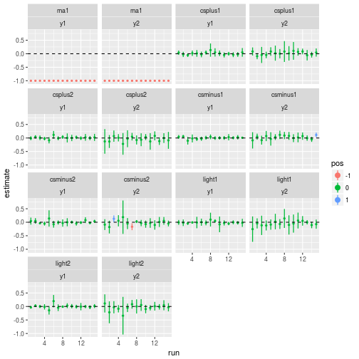

# Times Series Stuff for Claire 

## 1. How to install the package

```r
devtools::install_github("DanielBonnery/TimeSeriesStuffforClaire")
```


## 2. Reproduction of the computations made on CPS data. 


```r
library("TimeSeriesStuffforClaire")
demo("ComputeStats")
```



